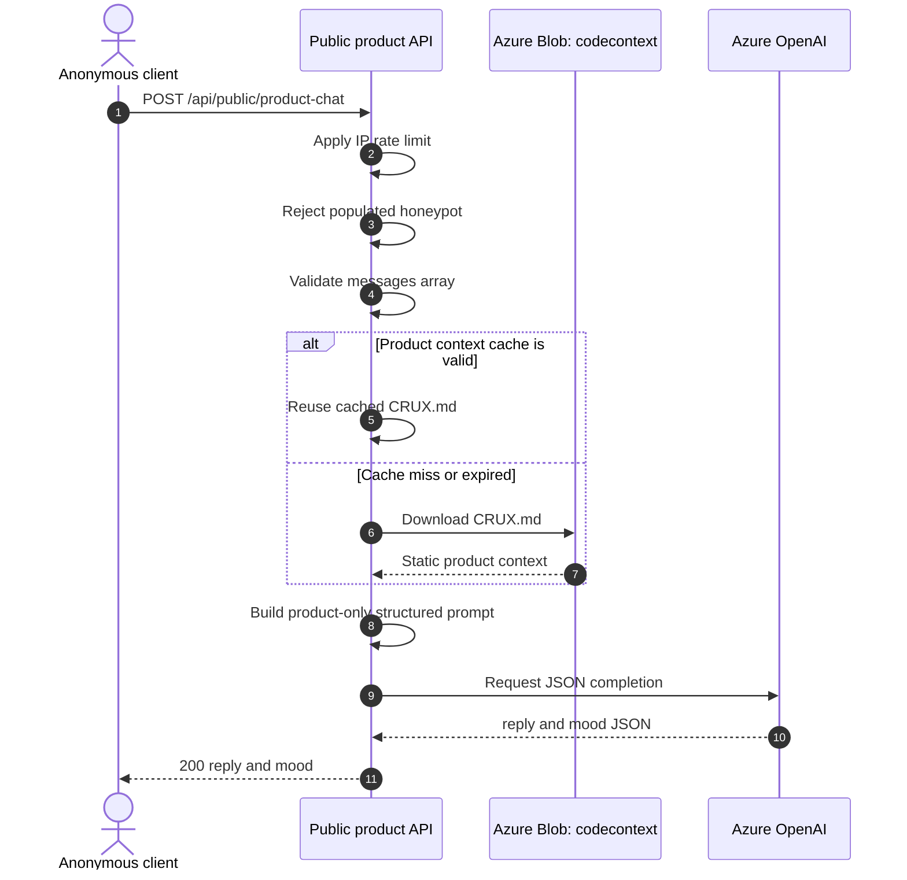
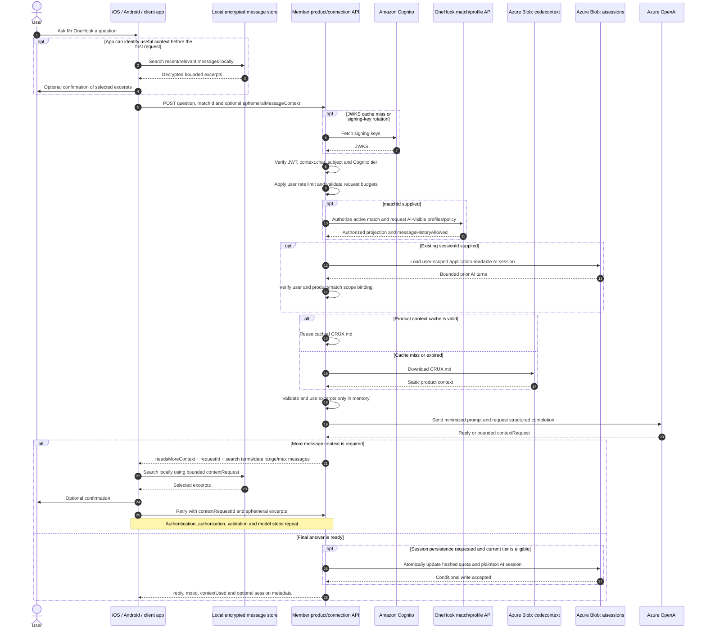

# OneHook UX Enhancement — Backend & Infrastructure

AI-driven chatbot API powered by a configurable **Azure OpenAI deployment** (Terraform defaults to **GPT-4o**), deployed to **Azure App Service** via **Terraform** and **GitHub Actions** with secretless **OIDC** deployment authentication.

---

## Architecture

```mermaid
flowchart LR
  subgraph Clients["Client devices"]
    Anonymous["Anonymous client"]
    MemberApp["Signed-in iOS, Android, or client app"]
    LocalMessages[("End-to-end encrypted match messages<br/>decrypted only on the user device")]
    LocalSearch["Search recent and relevant<br/>messages locally"]
    Confirm["Optional user confirmation<br/>for selected excerpts"]
  end

  subgraph AWS["Amazon Web Services · AWS"]
    Cognito["Amazon Cognito<br/>JWT/JWKS + tier claim"]
  end

  subgraph OneHookPlatform["OneHook platform services"]
    OneHookData["Authoritative match/profile policy API<br/>GET /api/ai-context/matches/:matchId"]
  end

  subgraph Azure["Microsoft Azure"]
    subgraph UX["OneHook UX Enhancement package · Azure App Service"]
      PublicRoute["POST /api/public/product-chat"]
      MemberRoute["POST /api/member/product-connection-chat"]
      UserAuth["Validate user JWT<br/>issuer · audience · JWKS · context.chat"]
      MatchGate{"matchId supplied?"}
      MatchAuth["Authorize active match<br/>and AI-visible profile policy"]
      ValidateExcerpts["Validate bounded ephemeral excerpts<br/>Never persist or log them"]
      SessionGate{"sessionOptions.persist?"}
      TierPolicy["Resolve verified Cognito tier<br/>and enforce session policy"]
      SessionStore["Load or save user-scoped<br/>application-readable AI session"]
      Assemble["Assemble minimized untrusted prompt<br/>product + profile + ephemeral excerpts + AI session"]
      ContextDecision{"More local context needed?"}
      ContextRequest["Return bounded search terms<br/>date range + max messages"]
      PublicResult["Product reply + mood"]
      MemberResult["Member reply + mood<br/>contextUsed + optional session metadata"]
    end

    subgraph AzureServices["Azure managed services"]
      ProductBlob[("Private codecontext container<br/>CRUX.md")]
      SessionBlob[("Private aisessions container<br/>AI turns + hashed quota ledgers")]
      OpenAI["Azure OpenAI<br/>structured completion"]
    end
  end

  Anonymous --> PublicRoute
  ProductBlob --> PublicRoute
  PublicRoute <-->|"Structured completion"| OpenAI
  PublicRoute --> PublicResult --> Anonymous

  MemberApp --> MemberRoute --> UserAuth
  Cognito -->|"Validate token and verified tier claim"| UserAuth
  UserAuth --> MatchGate
  MatchGate -->|"No · product only"| Assemble
  MatchGate -->|"Yes · connection context"| MatchAuth
  MatchAuth <-->|"Authorize match and profiles"| OneHookData
  MatchAuth --> ValidateExcerpts --> Assemble
  ProductBlob --> Assemble

  LocalMessages --> LocalSearch --> Confirm
  Confirm -->|"Memory-only ephemeralMessageContext"| MemberRoute
  ContextRequest --> MemberApp
  MemberApp -->|"Local search and retry"| LocalSearch

  UserAuth --> SessionGate
  SessionGate -->|"Yes"| TierPolicy --> SessionStore
  SessionStore <-->|"Plaintext at application layer<br/>Azure platform encryption still applies"| SessionBlob
  SessionStore -->|"Bounded prior AI turns"| Assemble

  Assemble <-->|"Structured completion"| OpenAI
  Assemble --> ContextDecision
  ContextDecision -->|"Yes"| ContextRequest
  ContextDecision -->|"No"| MemberResult --> MemberApp
  MemberResult -->|"Persist completed AI exchange when requested"| SessionStore

  style AWS fill:#fff7e6,stroke:#ff9900,stroke-width:2px
  style OneHookPlatform fill:#f7f3ff,stroke:#6f42c1,stroke-width:2px
  style Azure fill:#eef6ff,stroke:#0078d4,stroke-width:2px
```



The anonymous route answers product questions only. The member route always receives product context; `matchId` adds freshly authorized profile/match policy, and the app may attach a bounded `ephemeralMessageContext` selected after local decryption. UX Enhancement uses those excerpts only in memory for the current model request and never mirrors match messages in Azure. Separately, eligible Cognito tiers may opt into application-readable Mr OneHook AI sessions stored in a private Azure container; Azure platform encryption at rest still applies.

### How to read the arrows

The architecture flowchart shows **which components may communicate**; its arrows are dependency/data-flow links, not a single execution timeline. For exact runtime order, use the auto-numbered sequences below: `alt` means one mutually exclusive path, `opt` means a conditional step, and `loop` means the client may retry after a local search.

#### Public product chat sequence



#### Authenticated member and local-context retry sequence



A product-only member request omits `matchId` and can never request match-message excerpts. A connection request verifies the match and `messageHistoryAllowed` before using app-supplied excerpts. Excerpts are treated as untrusted conversational data, not authorization evidence, and are not written to session storage, logs, or Blob Storage.

#### Session lifecycle order

All session paths first verify the user JWT, `context.chat`, and the per-user rate limit.

1. **List sessions:** enumerate only `sessions/<hash(user)>/`, reject cross-user bindings, lazily remove expired records, and return non-content metadata with `scope: product | connection` instead of raw match IDs.
2. **Read a session:** require a currently eligible Cognito tier, load only the user-scoped application-readable session, verify user and scope bindings, freshly reauthorize the match only for a connection-scoped session, apply the current tier's message cap, then return bounded AI turns.
3. **Delete a session:** validate the user-scoped session ID, delete its private Blob record, release its hashed quota reservation, then return `204`. Deletion remains available after a tier downgrade.

Match-to-match messages never enter this lifecycle. They stay in the app's end-to-end encrypted local store and are shared only as bounded, temporary excerpts for a specific request.

### What Terraform Provisions

| Resource | Purpose |
|---|---|
| Resource Group | Container for all resources |
| App Service Plan (B1 Linux) | Hosts the Node.js backend |
| App Service | Public product and authenticated member APIs |
| Azure OpenAI + GPT-4o deployment | Structured chat completions |
| Hardened Storage Account | TLS 1.2 minimum, public nested items disabled, shared-key authentication disabled |
| Private `codecontext` container | Static OneHook product/repository context |
| Private `aisessions` container | Application-readable Mr OneHook AI turns and hashed quota ledgers; Azure platform encryption still applies |
| Storage lifecycle policy | Hard-cap deletion for AI sessions and quota ledgers |
| RBAC role assignments | Managed-identity access to OpenAI and container-scoped Blob session writes |

---

## Local Development

### Prerequisites

- Node.js 20+
- Azure CLI (`az login`) when exercising real Azure integrations
- Terraform 1.9+ for infrastructure validation

### Setup

```bash
cd backend
npm ci
npm test

# Create a .env file with required values; keep CONTEXTUAL_AI_ENABLED=false
# until the identity provider and OneHook data API contracts are configured.
npm run dev
```

### Environment Variables

| Variable | Description | Default | Required |
|---|---|---|---|
| `AZURE_OPENAI_ENDPOINT` | Azure OpenAI resource URL | — | Yes |
| `AZURE_OPENAI_DEPLOYMENT` | Model deployment name | `gpt-4o` | Recommended |
| `AZURE_STORAGE_ACCOUNT` | Storage account name | — | Yes |
| `AZURE_STORAGE_CONTAINER` | Static code-context container | `codecontext` | No |
| `PORT` | Server port | `8080` | No |
| `CONTEXTUAL_AI_ENABLED` | Enables authenticated contextual routes | `false` | No |
| `AUTH_ISSUER` | Exact access-token issuer | — | When enabled |
| `AUTH_AUDIENCE` | Exact authenticated member-API audience | — | When enabled |
| `AUTH_JWKS_URI` | HTTPS signing-key endpoint | — | When enabled |
| `AUTH_ALLOWED_ALGORITHMS` | Comma-separated asymmetric JWT algorithms | `RS256` | No |
| `AUTH_CHAT_PERMISSION` | Required user scope/role | `context.chat` | No |
| `CORS_ALLOWED_ORIGINS` | Comma-separated exact OneHook browser origins | — | When enabled |
| `ONEHOOK_DATA_API_URL` | Authoritative OneHook match/profile-policy service base URL | — | When enabled |
| `ONEHOOK_DATA_API_SCOPE` | Managed-identity OAuth scope for that service | — | When enabled |
| `ONEHOOK_DATA_API_TIMEOUT_MS` | Source-service timeout | `3000` | No |
| `AZURE_SESSION_CONTAINER` | Private Mr OneHook AI-session container | — | When enabled |
| `CONTEXT_MAX_INPUT_CHARACTERS` | Maximum question or individual excerpt length | `4000` | No |
| `EPHEMERAL_CONTEXT_MAX_MESSAGES` | Maximum app-selected excerpts per request | `30` | No |
| `EPHEMERAL_CONTEXT_MAX_CHARACTERS` | Maximum total excerpt characters per request | `12000` | No |
| `CONTEXT_REQUEST_MAX_MESSAGES` | Maximum messages Mr OneHook may ask the app to find locally | `8` | No |
| `CHAT_SESSION_STORAGE_ENABLED` | Enables application-readable authenticated AI-session persistence | `false` | No |
| `AUTH_TIER_CLAIM` | Verified Cognito access-token tier claim; may be `cognito:groups` | `custom:tier` | When session storage is enabled |
| `CHAT_SESSION_TIER_POLICIES` | JSON map of eligible tiers and server-enforced limits | `{}` | When session storage is enabled |
| `CHAT_SESSION_MAX_RETENTION_DAYS` | Infrastructure/application retention hard cap | `90` | No |

Terraform injects the non-secret production settings. Authentication values remain empty and `contextual_ai_enabled` remains `false` by default; provide reviewed environment-specific Terraform values only after the upstream contracts are ready.

---

## API Endpoints

| Method | Path | Authentication | Description |
|---|---|---|---|
| `GET` | `/health` | None | Health check |
| `POST` | `/api/public/product-chat` | None | Anonymous product questions; accepts `{ messages, userDemographics }` and cannot access private context |
| `POST` | `/api/member/product-connection-chat` | Bearer token with `context.chat` | Product questions with optional authorized match/profile and app-selected ephemeral message excerpts; tier-gated AI sessions |
| `GET` | `/api/member/product-connection-chat/sessions` | Bearer token with `context.chat` | List the caller's retained AI-session metadata |
| `GET` | `/api/member/product-connection-chat/sessions/:sessionId` | Bearer token, `context.chat`, eligible current tier | Read one own AI session; connection sessions receive a fresh match authorization check |
| `DELETE` | `/api/member/product-connection-chat/sessions/:sessionId` | Bearer token with `context.chat` | Delete one own retained AI session, including after downgrade |

### Public product chat contract

```json
{
  "messages": [
    { "role": "user", "content": "What is OneHook?" }
  ],
  "userDemographics": {
    "gender": "optional",
    "sexualPreference": "optional"
  }
}
```

This route has no authentication or session persistence and can use only static product context. A successful response is structured as:

```json
{
  "reply": "...",
  "mood": "Happy"
}
```

### Member product and connection chat contract

Product-only request:

```json
{
  "message": "Which OneHook features help me make better connections?",
  "contextOptions": {
    "includeProfile": true,
    "includeMessageHistory": true
  },
  "sessionOptions": {
    "persist": true,
    "sessionId": "optional-uuid-returned-by-an-earlier-request"
  }
}
```

Connection request or local-search retry:

```json
{
  "matchId": "opaque-match-id",
  "message": "What did they say earlier about travelling?",
  "contextRequestId": "optional-uuid-returned-by-needsMoreContext",
  "contextOptions": {
    "includeProfile": true,
    "includeMessageHistory": true
  },
  "ephemeralMessageContext": {
    "excerpts": [
      {
        "speaker": "match",
        "sentAt": "2026-10-04T10:00:00.000Z",
        "text": "I would really like to visit Japan."
      }
    ],
    "historyTruncated": true,
    "userConfirmed": true
  }
}
```

The caller must not send a user ID, profile, or participant list. Identity comes only from the verified token. Omit `matchId` for a product-only question; that mode does not call the match/profile API and cannot include `ephemeralMessageContext`. Include `matchId` only when authorized connection context is wanted. The backend validates excerpt speakers/timestamps/text, total count and total characters, but treats excerpt content as untrusted conversation data and never writes it to AI sessions, logs, or Blob Storage. For connection requests the backend calls:

```http
GET {ONEHOOK_DATA_API_URL}/api/ai-context/matches/{matchId}
Authorization: Bearer <managed-identity-token>
X-OneHook-User-Id: <verified-token-subject>
```

The authoritative service must return an active match, bind `requestingUser.id` to that subject, provide only AI-visible profile fields, and return `contextPolicy.profileAllowed`, `contextPolicy.messageHistoryAllowed`, and `contextPolicy.policyVersion`. A block, unmatch, missing consent, or membership failure must be enforced by that service; the AI backend also verifies the returned binding and status.

When the supplied context is insufficient, the member API may return a bounded local-search request instead of guessing:

```json
{
  "reply": "Please share the earlier travel discussion.",
  "mood": "Thinking",
  "needsMoreContext": true,
  "contextRequest": {
    "requestId": "uuid",
    "searchTerms": ["travel", "holiday", "Japan"],
    "dateRange": {
      "from": "2026-08-01T00:00:00.000Z",
      "to": "2026-10-04T23:59:59.000Z"
    },
    "maxMessages": 8
  },
  "contextUsed": {
    "profile": true,
    "match": true,
    "messageHistory": false,
    "messageCount": 0,
    "chatSession": false,
    "sessionMessageCount": 0
  },
  "requestId": "uuid"
}
```

The app searches and decrypts locally, optionally asks the user to confirm the selected excerpts, then retries with `contextRequestId` and `ephemeralMessageContext`. The backend does not persist a clarification exchange that only requests more context.

A successful member response discloses categories/counts rather than private context content. The `session` object appears only when persistence was requested and succeeded:

```json
{
  "reply": "...",
  "mood": "Thinking",
  "contextUsed": {
    "profile": false,
    "match": false,
    "messageHistory": false,
    "messageCount": 0,
    "chatSession": true,
    "sessionMessageCount": 2
  },
  "requestId": "uuid",
  "session": {
    "sessionId": "uuid",
    "updatedAt": "2026-09-29T00:00:00.000Z",
    "expiresAt": "2026-10-29T00:00:00.000Z",
    "messageCount": 4
  }
}
```

### Cognito tier-based chat sessions

Session persistence is independent from contextual message-history collection and remains disabled unless `CHAT_SESSION_STORAGE_ENABLED=true` and at least one valid tier policy is configured. The tier is never accepted from the request body. It is resolved only from the JWT after signature, issuer, audience, expiry, and permission validation.

By default the backend reads `custom:tier`. To use Cognito groups, configure `AUTH_TIER_CLAIM=cognito:groups`; the first group that exactly matches a server-configured normalized policy key is selected. Ensure the claim is present in the **access token** used by this API (for custom Cognito claims this may require a Pre Token Generation trigger). Missing, unknown, malformed, or disabled tiers cannot create, continue, or read session content.

Example policy:

```json
{
  "plus": {
    "enabled": true,
    "maxSessions": 10,
    "maxMessages": 50,
    "retentionDays": 30
  },
  "premium": {
    "enabled": true,
    "maxSessions": 50,
    "maxMessages": 200,
    "retentionDays": 90
  }
}
```

`CHAT_SESSION_TIER_POLICIES` is the compact JSON form of that object. Terraform accepts the equivalent `chat_session_tier_policies` map with snake-case limit fields. Backend safety caps are 100 sessions, 200 messages per session, and `CHAT_SESSION_MAX_RETENTION_DAYS` retention.

Persistence is opt-in per request. Set `sessionOptions.persist=true` without a `sessionId` to create a session; the response returns `session.sessionId`. Supply that UUID on a later request to continue it. Send a stable UUID `Idempotency-Key` header when retrying a request so the same exchange is not stored twice. Existing member requests without `sessionOptions` are not stored.

Session listing returns non-content metadata and a non-identifying scope instead of a raw match ID:

```json
{
  "sessions": [
    {
      "sessionId": "uuid",
      "scope": "product",
      "createdAt": "2026-09-29T00:00:00.000Z",
      "updatedAt": "2026-09-29T00:05:00.000Z",
      "expiresAt": "2026-10-29T00:05:00.000Z",
      "messageCount": 4
    }
  ]
}
```

`GET .../sessions/:sessionId` returns the eligible owner's bounded AI turns; connection-scoped reads first reauthorize the match. `DELETE .../sessions/:sessionId` returns `204` and remains available to the authenticated owner after a tier downgrade.

Each session is stored as application-readable JSON in the private `aisessions` container. Azure Storage platform encryption at rest still applies, but there is no additional application-level AES/Key Vault layer. Blob paths, Cognito subjects, and quota references are hashed; the private session record contains the AI turns, session ID, and optional match ID needed for continuation. Product-only and connection sessions carry distinct validated scope references, so the two scopes cannot be confused. Continuation and content reads require the current eligible tier and user ownership; connection sessions additionally require a fresh active-match authorization check. All authenticated owners may list retained metadata and delete their own sessions after downgrade for privacy control. Per-tier `retentionDays` is the logical expiry: expired sessions are denied and lazily deleted on access. The infrastructure lifecycle rule guarantees physical deletion no later than `CHAT_SESSION_MAX_RETENTION_DAYS`.

### Client integration contract

The iOS and Android clients in sibling `OneHookPlatform` and the web client in sibling `OneHookClient` implement this contract using their existing networking, E2EE, storage, and UI conventions. Each client owns its locally decrypted match history and applies the same bounded selection and confirmation rules before sharing excerpts.

For a match-aware question, the client should:

1. Decrypt and search only the selected match locally.
2. Start with a small recent window, then add a few older excerpts matching the user's words/date range.
3. Enforce the server-advertised `maxMessages` and local character budget before upload.
4. Optionally show the selected excerpts and ask the user to confirm.
5. Send only `speaker`, `sentAt`, and `text`; never send the user's permanent message key.
6. Retry with `contextRequestId` when Mr OneHook returns `needsMoreContext`.
7. Keep match excerpts out of client analytics and crash logs.

UX Enhancement reauthorizes the match, validates the excerpt envelope, uses it only for that model request, and discards it. It does not provide a message-ingestion endpoint and does not maintain a match-message copy in Azure.

See [`CONTEXTUAL_AI_IMPLEMENTATION_PLAN.md`](./CONTEXTUAL_AI_IMPLEMENTATION_PLAN.md) for consent, retention, threat-model, rollout, and cross-repository decisions that still require owner approval.

## Activation checklist

The code and infrastructure definitions are present, but private context and session persistence intentionally remain off by default. Before enabling them in an environment:

1. Configure Cognito access-token validation: issuer, API audience, JWKS URI, asymmetric algorithm, and the `context.chat` scope/role.
2. Put the configured tier claim in the **access token** and define reviewed `chat_session_tier_policies`; do not accept a tier from client input.
3. Implement the authoritative `GET /api/ai-context/matches/:matchId` contract and grant the App Service managed identity its configured OAuth scope.
4. Configure exact `cors_allowed_origins`, profile/message-history consent policy, AI-session retention, and deletion behavior.
5. Update each client to search/decrypt locally, enforce excerpt budgets, optionally confirm excerpts, and retry bounded `contextRequest` responses.
6. Ensure the AzureRM remote-state resources in `infra/main.tf` already exist, then review a Terraform plan.
7. Set `contextual_ai_enabled=true`; separately set `chat_session_storage_enabled=true` only when Cognito tier policies are ready.
8. Test product-only, match authorization, block/unmatch, excerpt rejection, local retry, tier downgrade, session deletion, and cross-user scenarios.

---

## Deployment

### First-Time Setup: OIDC Trust

We use **Azure OIDC** so GitHub Actions can deploy to Azure **without storing any secret keys**.

#### Prerequisites
1. **Azure CLI**: `az login`
2. **GitHub CLI**: `gh auth login`

#### Run the setup script (once)
```bash
chmod +x setup-oidc.sh
./setup-oidc.sh
```

This script:
- Fetches your **GitHub owner and repo numeric IDs** (required by GitHub's OIDC subject claim format)
- Creates an **Azure AD Application** (Service Principal)
- Grants **Contributor** + **User Access Administrator** roles on your subscription
- Creates a **Federated Identity Credential** with the correct subject claim: `repo:pushpsood@<owner_id>/OneHookUxEnhancement@<repo_id>:ref:refs/heads/main`
- Saves `AZURE_CLIENT_ID`, `AZURE_TENANT_ID`, `AZURE_SUBSCRIPTION_ID` to GitHub Secrets

> **Note:** If the OIDC subject claim format changes in the future, you can update just the credential without re-creating the entire app. See [Troubleshooting](#troubleshooting).

### CI/CD Pipeline

Every push to `main` that touches `backend/` or `infra/` triggers the pipeline:

```
Push to main
    │
    ▼
┌─────────────────────┐
│  Job 1: Terraform   │
│  ├─ Azure Login     │
│  ├─ terraform init  │
│  ├─ terraform plan  │
│  └─ terraform apply │
└────────┬────────────┘
         │ (on success)
         ▼
┌─────────────────────┐
│  Job 2: Deploy API  │
│  ├─ npm ci          │
│  ├─ npm test        │
│  │  └─ tsc + 18 tests│
│  ├─ npm prune       │
│  │  └─ omit dev deps│
│  ├─ Azure Login     │
│  └─ Deploy to App   │
│     Service         │
└─────────────────────┘
```

The workflow also supports **manual trigger** via `workflow_dispatch` from the Actions tab.

### Local Validation (Safe, No Deployment)

You can validate Terraform syntax locally before pushing to GitHub. This **will not deploy or modify** any resources:

```bash
cd infra
terraform init -backend=false
terraform validate
```

### Manual Deployment

If you need to deploy manually:

```bash
# 1. Login to Azure
az login

# 2. Apply Terraform
cd infra
terraform init
terraform plan
terraform apply

# 3. Deploy backend
cd ../backend
npm ci
npm test
npm prune --omit=dev
az webapp deploy \
  --resource-group onehook-chatbot-rg \
  --name onehook-chatbot-api \
  --src-path .
```

---

## Cross-Repo Dependency: OneHookClient Context

The **OneHookClient** repo has a `push-context.yml` workflow that uploads its source code to this project's Azure Blob Storage container (`codecontext`). The chatbot uses this context to answer questions about the platform.

**Deploy order matters:** This repo's Terraform must run first to create the storage account before OneHookClient's push-context workflow can upload to it.

The contract between the repos:
| Value | Defined in Terraform (`variables.tf`) | Used by OneHookClient (`push-context.yml`) |
|---|---|---|
| Resource Group | `onehook-chatbot-rg` | Hardcoded |
| Container Name | `codecontext` | Hardcoded |
| Storage Account | Dynamic (random suffix) | Discovered via `az storage account list` |

---

## Rollback

```bash
# Option 1: Redeploy a previous commit via GitHub Actions
# Go to the Actions tab → select a successful past run → "Re-run all jobs"

# Option 2: Redeploy from CLI
git checkout <previous-commit-sha>
cd backend
az webapp deploy \
  --resource-group onehook-chatbot-rg \
  --name onehook-chatbot-api \
  --src-path .
```

To roll back **infrastructure changes**, revert the Terraform files and push:
```bash
git revert <commit-sha>
git push origin main
```

---

## Monitoring & Logging

### App Service Logs

```bash
# Stream live logs
az webapp log tail \
  --resource-group onehook-chatbot-rg \
  --name onehook-chatbot-api

# Download log files
az webapp log download \
  --resource-group onehook-chatbot-rg \
  --name onehook-chatbot-api \
  --log-file logs.zip
```

### Health Check

The App Service is configured with a health check at `/health`. Azure will automatically restart the app if the health check fails consecutively.

### Recommended: Application Insights

For production monitoring, add Azure Application Insights to the Terraform config for:
- Request tracing and latency metrics
- Error rate dashboards
- Custom alerts on 5xx rates or response times

---

## Troubleshooting

### OIDC Login Fails (`AADSTS700213: No matching federated identity record`)

GitHub's OIDC subject claim includes numeric owner/repo IDs. If the format changes or credentials were created with an old format, update just the credential:

```bash
APP_ID=$(az ad app list --display-name OneHookGitHubActions --query '[0].appId' -o tsv)
az ad app federated-credential delete --id $APP_ID --federated-credential-id github-actions-main

OWNER_ID=$(gh api /users/pushpsood --jq '.id')
REPO_ID=$(gh api /repos/pushpsood/OneHookUxEnhancement --jq '.id')

az ad app federated-credential create --id $APP_ID --parameters "{
  \"name\": \"github-actions-main\",
  \"issuer\": \"https://token.actions.githubusercontent.com\",
  \"subject\": \"repo:pushpsood@${OWNER_ID}/OneHookUxEnhancement@${REPO_ID}:ref:refs/heads/main\",
  \"audiences\": [\"api://AzureADTokenExchange\"]
}"
```

---

## Terraform State

Terraform is configured to use the AzureRM remote backend named in `infra/main.tf`. Those state resources must already exist before CI runs `terraform init`; backend bootstrapping remains an operational prerequisite and is intentionally not created by this configuration.

---

## Project Structure

```text
OneHookUXEnhancement/
├── .github/workflows/deploy.yml       # Tests, Terraform deployment, App Service deployment
├── backend/
│   ├── src/
│   │   ├── index.ts                   # Express server and anonymous route
│   │   ├── auth.ts                    # JWT/JWKS and permission enforcement
│   │   ├── contextRoutes.ts           # Authenticated chat and session routes
│   │   ├── oneHookDataClient.ts       # Authoritative match/profile projection client
│   │   ├── plaintextChatSessionStore.ts # Tier-gated application-readable AI sessions
│   │   └── __tests__/                 # TypeScript Node test suite
│   ├── package.json
│   └── tsconfig.json
├── infra/
│   ├── main.tf                        # Azure resources and RBAC
│   ├── variables.tf
│   └── outputs.tf
├── CONTEXTUAL_AI_IMPLEMENTATION_PLAN.md
├── setup-oidc.sh
└── README.md
```
